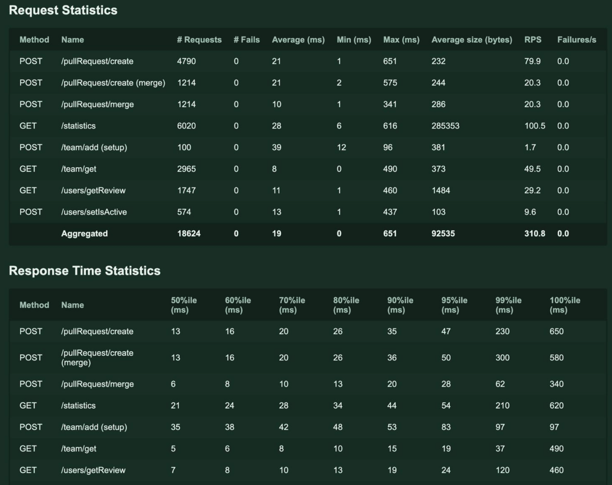

Запуск проекта 
	docker-compose up

Запуск unit-тестов
	go test ./...

Запуск нагрузочных тестов (Locust)
	1) Установить зависимости:
	    cd load-tests
	    python3 -m venv .venv
	    source .venv/bin/activate
	    pip install -r requirements.txt

	2)Запустить нагрузочный прогон:
	    ./run_load_tests.sh

Статус кодов и формат ошибок не были полностью определены
	В ТЗ не описано:
	1)какой код отдавать при дубле PR
	2)какой ответ при повторном MERGE (идемпотентность не детализирована)
	Решение:
	Добавлена мапа кодов ошибок → HTTP статус.
	MERGE сделан идемпотентным: повторный вызов возвращает 200 с тем же объектом.

	DTO и Domain не разграничены в задании
	В ТЗ нет указаний о слоях
	Но практический код должен быть структурирован: domain, dto, service, repository, handler.
	Решение:
	1)Domain содержит чистые сущности (без JSON-тегов).
	2)DTO содержит request/response модели и валидацию.
	3)Handlers → работают только с DTO.
	4)Services → только с domain.
	5)Repository → domain-in, domain-out.

	Идентификаторы не были формально нормированы
	Не указано:
	1)макс длина
	2)допустимые символы
	3)формат user_id, pr_id, team_name
	Решение:
	В dto реализована строгая валидация.
	Простые критерии: a-zA-Z0-9-_, ≤255 символов

Дополнительные задания, который были выполнены: 

	1)Добавить простой эндпоинт статистики
	2)Провести нагрузочное тестирование полученного решения и приложить краткие результаты тестирования к решению
	3)Реализовать интеграционное
	4)Описать конфигурацию линтера

Результаты нагрузочного теста: 

Видно, что в рамках рекомендованных границ программа отрабатывает
